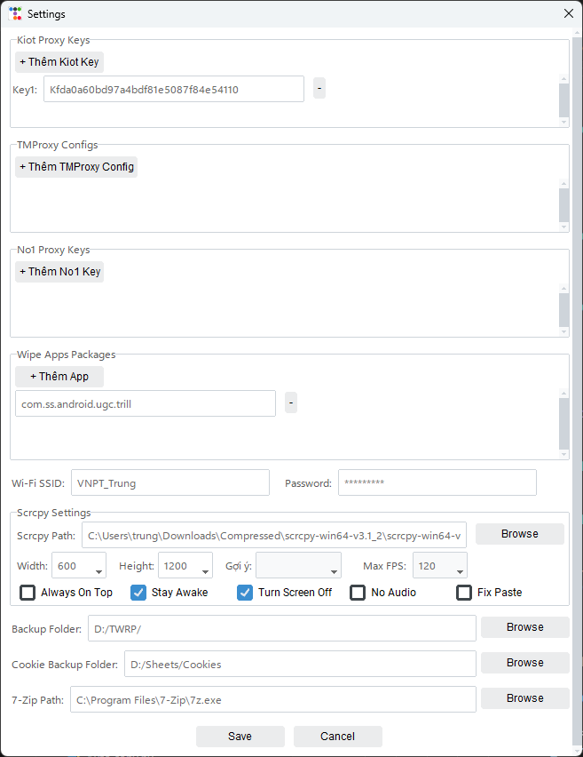

  <a href="README.md">Vietnamese</a> |
  <a href="README-ENG.md"><strong>English</strong></a>

# Android Device Manager

> (nội dung tiếng Việt …)

  
  

# Android Device Manager

> Version 3.0 · © 2025 Hiamtrung102™

**Android Device Manager** is a Windows desktop application that provides a polished GUI for interacting with Android devices via ADB and TWRP, from backups/restores through deep-level spoofing and bulk operations.

---

## 📑 Table of Contents

- [📦 Key Features](#-key-features)  
- [🛣️ Usage Workflows](#-usage-workflows)  
- [📸 Screenshots](#-screenshots)  
- [📋 Changelog](#-changelog)  
- [🐞 Troubleshooting & FAQ](#-troubleshooting--faq)  
- [🚀 Getting Started](#-getting-started)  
- [🛠️ Advanced Configuration](#️-advanced-configuration)  
- [🗺️ Roadmap](#️-roadmap)  
- [🤝 Contributing](#-contributing)  
- [📄 License](#-license)  

---

## 📦 Key Features

1. 🗄️ **TWRP Backup & Restore**  
   - 📥 Full Backup & Light (config-only) Backup  
   - 🔄 Restore from any saved backup (folders or archives) with automatic extraction  
   - ⚙️ Format Data on-device  
   - 📶 Auto-WiFi-Connect: push Wi-Fi configs automatically  

2. 🛠️ **Device Spoofing**  
   - 🎨 Select Brand/Model or Random → Generate Info → Apply Info  
   - 🔒 Deep-level changes: fingerprint, security patch, baseband, IMEI(s), Android ID, SIM/ICCID/IMSI, GPS coords, MAC addresses…  
   - 🚀 Instantly apply new configuration on the device  

3. 🌐 **Proxy Manager**  
   - 🔑 Supports three providers: Kiot, TMProxy, No1  
   - 🌍 Auto-fetch HTTP/SOCKS5 proxies, apply to single or multiple devices  
   - ⚙️ Manage API keys and configs directly in the UI  

4. 📺 **Scrcpy & Auto-Scrcpy**  
   - ▶️ Launch Scrcpy per device or “Scrcpy All” for all devices  
   - ⚙️ Customize executable path, window size, max FPS, flags (Always-On-Top, Stay-Awake, Turn-Screen-Off, No-Audio, Legacy-Paste)  
   - 🤖 Auto-Scrcpy: automatically start Scrcpy on device connect  
   - 🔄 Auto-Scrcpy All: maintain Scrcpy sessions for every device, auto-tile windows  

5. ✨ **Additional Utilities**  
   - 📸 Capture Screen → crop center → copy to clipboard  
   - 📦 Install APK in a few clicks  
   - 📤 Push any file to a custom path on device  
   - 🍪 Get-Cookie: extract `SPC_ST` cookie from WebView SQLite  
   - 💻 Custom Command (Admin only) for arbitrary shell/ADB commands  
   - 📝 Macros: Python scripts (Click/Swipe/Paste/Delay) with auto-logging  

6. 📝 **Logging & Configuration**  
   - 🔄 Auto-refresh device list every 5s  
   - 📋 Log to both UI console and local log files  
   - ⚙️ All settings and storage paths are fully customizable in **Settings**  

---

## 🛣️ Usage Workflows

1. **Onboard a New Device**  
   - Connect → Refresh → Spoof Info → Initial Backup → Install APK → Start Scrcpy → Extract Cookie  

2. **Bulk Proxy Deployment**  
   - Connect multiple devices → Open Proxy Manager → Select provider/region → Auto IP Proxy → Verify connectivity  

3. **Automated Testing with Macros**  
   - Connect → Scrcpy All → Select macro → Run script → Monitor logs → Repeat on next device  

4. **Restore to a Previous State**  
   - Connect → Refresh → Select backup → Restore → Reboot → Verify  

5. **Deep-Spoof & Clean**  
   - Connect → Spoof Info → Apply → Format Data → (optional) Wipe Apps → Reboot  

---

## 📸 Screenshots

> Drop screenshots into `./screenshots/` and update paths below.

| Main Interface                         | Settings & Proxy           |
|----------------------------------------|----------------------------|
|  |  |

---

## 📋 Changelog

### v3.0
- ✨ Redesigned Settings UI: manage proxy keys/configs, wipe-apps, scrcpy flags  
- 🌐 Multi-provider Proxy Manager (Kiot, TMProxy, No1)  
- 🤖 Enhanced Auto-Scrcpy & Auto-Scrcpy All  
- 🔄 Multi-layer auto-extraction for restores (archives & folders)  
- 🔒 Comprehensive deep-spoof capabilities  
- 📝 Advanced macro logging  
- 🍪 Improved Get-Cookie with auto-copy  
- 🗃️ Remote device templates & persistent log queue  

### v2.5
- 🍪 Added Shopee Get-Cookie feature  
- ⚡ Optimized 5s device refresh  
- 🐛 Fixed combobox & button state issues  

> See full details in [`CHANGELOG.md`](./CHANGELOG.md)

---

## 🐞 Troubleshooting & FAQ

- **“adb devices” shows nothing**  
  - 🔧 Ensure USB Debugging is enabled & drivers installed  
  - 🖥️ Run `adb devices` in a terminal to verify  

- **Scrcpy fails to launch**  
  - 📁 Verify `scrcpy.exe` path in Settings  
  - 🖥️ Try `scrcpy -s <device_id>` from command line  

- **Permission denied on restore**  
  - 🔒 Boot into TWRP/Recovery and ensure root access  

- **Get-Cookie returns nothing**  
  - 🔍 Verify Shopee app version & WebView cookie path  
  - 🔐 Check file read permissions on device  

---

## 🚀 Getting Started

### 🖥️ Prerequisites
- 💻 Windows 10 or later  
- 📟 [ADB (Platform-Tools)](https://developer.android.com/studio/releases/platform-tools)  
- 💠 .NET Framework 4.7.2 or newer  
- 🐍 Python 3.x (optional, for Macros)  

### 💾 Installation
1. 🌐 Go to [Releases](https://github.com/hiamtrung103/Android-Device-Manager/releases)  
2. ⬇️ Download the ZIP or EXE for your system  
3. 📂 Unzip (if needed) → 🔧 Run `TWRPManager.exe`  

### 🔌 Connecting Your Device
1. 🔧 Enable **USB Debugging** on your Android device  
2. 🔌 Plug in via USB → wait for the device list to populate  

### ⚡ Quick Start
1. 📱 **Select your device** & click **Refresh**  
2. 🗄️ **Backup/Restore/Format/Reboot/Recovery** via **Operations** panel  
3. 🎭 **Spoof**: choose Brand/Model → Generate Info → Apply Info  
4. 🌐 **Proxy**: select provider/region → Auto IP Proxy / Set HTTP / Set SOCKS5 / Clear Proxy  
5. 📺 **Scrcpy**: start manually or enable Auto-Scrcpy  
6. 📝 **Macro**: pick a `.py` in macros folder → Run / Refresh  
7. 🍪 **Cookie**: hit **Get-Cookie** → gets copied to your clipboard  

---

## 🛠️ Advanced Configuration

Open **Settings** to:
- 🔑 Manage proxy keys/configs & wipe-apps list  
- 📍 Set paths for `scrcpy.exe`, `7z.exe`, Wi-Fi scripts  
- 📂 Choose custom folders for backups, cookies, and macros  
- ⚙️ Fine-tune Scrcpy window size, FPS, and flags  

---

## 🗺️ Roadmap

- **v3.1**: 🌙 Dark Mode & 🌐 Multi-language support  
- **v3.2**: 🔌 Plugin architecture & ⚙️ Auto-update mechanism  
- **v3.3**: 🎨 Customizable Themes & Layouts  
- **v3.4**: ☁️ Cloud Sync for backups & settings  
- **v3.5**: ⏰ Scheduled Tasks & Reminders  
- **v4.0**: 🖌️ UI Overhaul & Responsive Design  
- **v4.1**: 👥 Role-based Access & Multi-user Profiles  
- **v4.2**: 🔗 REST API for remote control  
- **v4.3**: 📊 Web Dashboard & Real-time Analytics  
- **v5.0**: 📱 Mobile Companion App (Android/iOS)  
- **v5.1**: 🛒 Plugin Marketplace & Community Hub  
- **v5.2**: 🤖 AI-driven Macro Recommendations & Error Detection  
- **v6.0**: 🔄 CI/CD Integration & Deployment Support  

---

## 🤝 Contributing

1. 🍴 Fork the repo & create a `feature/...` or `bugfix/...` branch  
2. 📏 Follow [CONTRIBUTING.md](./CONTRIBUTING.md) for code style and commit guidelines  
3. 🔀 Submit a Pull Request to `main`  
4. 📜 Adhere to [CODE_OF_CONDUCT.md](./CODE_OF_CONDUCT.md)  

---

## 📄 License

Released under the **MIT License**.  
