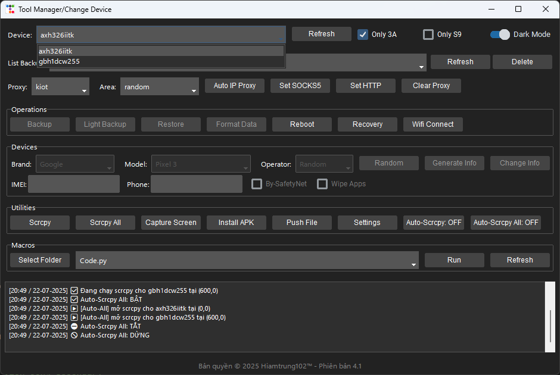
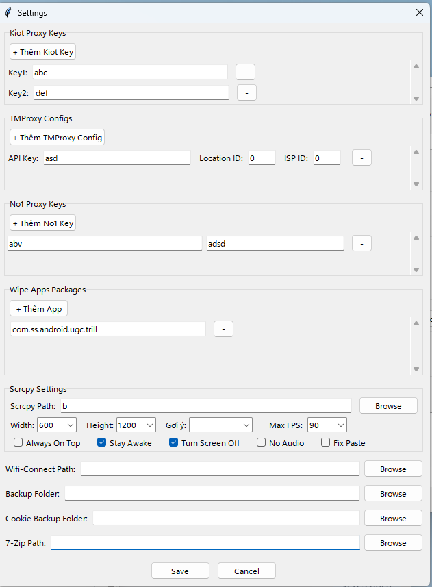
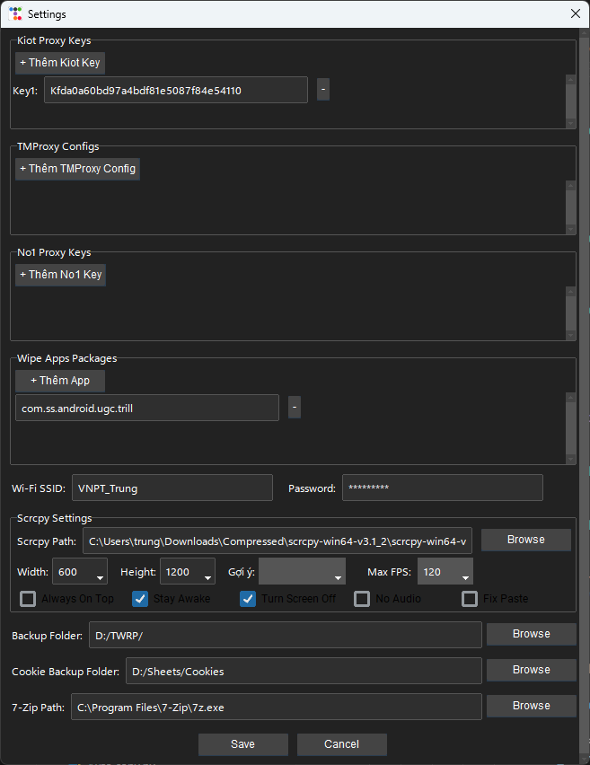

  <a href="README.md"><strong>Vietnamese</strong></a> |
  <a href="README-ENG.md">English</a>

# Android Device Manager

> Phiên bản 3.0 · Bản quyền © 2025 Hiamtrung102™

**Android Device Manager** là một ứng dụng desktop Windows, cung cấp giao diện trực quan để thao tác với thiết bị Android qua ADB và TWRP, từ backup/restore đến spoof thông tin và điều khiển hàng loạt.

---

## 📑 Mục lục

- [📦 Tính năng chính](#-tính-năng-chính)  
- [📸 Screenshots](#-screenshots)  
- [📋 Changelog](#-changelog)  
- [🐞 Troubleshooting & FAQ](#-troubleshooting--faq)  
- [🚀 Bắt đầu](#-bắt-đầu)  
- [🛠️ Cấu hình nâng cao](#️-cấu-hình-nâng-cao)  
- [🗺️ Roadmap](#️-roadmap)  
- [🤝 Đóng góp](#-đóng-góp)  
- [📄 License](#-license)  

---

## 📦 Tính năng chính

1. 🗄️ **Quản lý Backup/Restore (TWRP)**
   - 📥 Full Backup & Light Backup (siêu nhẹ)  
   - 🔄 Restore từ các bản backup đã lưu, tự động giải nén và đẩy lên thiết bị  
   - ⚙️ Format Data trực tiếp trên thiết bị  
   - 📶 Auto-WiFi-Connect: đẩy file cấu hình Wi-Fi tự động  

2. 🛠️ **Spoof thông tin thiết bị**
   - 🎨 Chọn Brand/Model hoặc Random → Generate Info → Apply Info  
   - 🔒 Sinh sâu các property: fingerprint, security patch, baseband, IMEI, Android ID, SIM/ICCID/IMSI, GPS, MAC…  
   - 🚀 Áp dụng cấu hình mới trực tiếp lên thiết bị  

3. 🌐 **Proxy Manager**
   - 🔑 Hỗ trợ 3 provider: Kiot, TMProxy, No1  
   - 🌍 Lấy proxy HTTP/SOCKS5 tự động, set cho một hoặc nhiều thiết bị  

4. 📺 **Scrcpy & Auto-Scrcpy**
   - ▶️ Chạy Scrcpy cho từng thiết bị hoặc Scrcpy All  
   - ⚙️ Tùy chỉnh đường dẫn, kích thước cửa sổ, FPS, flags (Always-On-Top, Stay-Awake, Turn-Screen-Off, No-Audio, Fix-Paste)  
   - 🤖 Auto-Scrcpy: tự động khởi Scrcpy khi có thiết bị mới  
   - 🔄 Auto-Scrcpy All: duy trì Scrcpy cho mọi thiết bị, tự động sắp xếp cửa sổ  

5. ✨ **Tiện ích bổ sung**
   - 📸 Capture Screen → crop giữa → copy vào clipboard  
   - 📦 Install APK nhanh từ file `.apk`  
   - 📤 Push File lên thiết bị với đường dẫn tuỳ chọn  
   - 🍪 Get-Cookie: trích xuất `SPC_ST` từ SQLite của WebView  
   - 💻 Custom Command: chạy bất kỳ lệnh shell/ADB nào  
   - 📝 Macros: thư mục chứa script Python (Click/Swipe/Paste/Delay), log thao tác  

6. 📝 **Logging & Cấu hình**
   - 🔄 Tự động refresh danh sách thiết bị mỗi 5 giây  
   - 📋 Ghi log lên giao diện và file log nội bộ  
   - ⚙️ Tất cả cài đặt & thư mục lưu trữ có thể tùy chỉnh trong phần Settings  

---

## 📸 Screenshots

| Main Interface                         | Settings & Proxy           |
|----------------------------------------|----------------------------|
|  |  |
| Main Interface (Dark)                     | Settings & Proxy (Dark)           |
|  |  |

---

## 📋 Changelog

### v3.0
- ✨ Giao diện Settings mới: quản lý proxy keys/configs, wipe-apps, scrcpy flags  
- 🌐 Proxy Manager đa provider (Kiot, TMProxy, No1)  
- 🤖 Auto-Scrcpy All & Auto-Scrcpy nâng cao  
- 🔄 Restore auto giải nén multi-layer (archive, thư mục)  
- 🔒 Deep-spoof properties toàn diện  
- 📝 Macros logging nâng cao  
- 🍪 Get-Cookie cải tiến, copy tự động  
- 🗃️ Load device templates & lưu log queue  

### v2.5
- 🍪 Thêm Get-Cookie Shopee  
- ⚡ Tối ưu refresh thiết bị mỗi 5s  
- 🐛 Fix UI combobox & button state logic  
> Xem chi tiết tại [`CHANGELOG.md`](./CHANGELOG.md)

---

## 🐞 Troubleshooting & FAQ

- **ADB không nhận thiết bị**  
  - 🔧 Kiểm tra USB Debugging đã bật, driver đã cài  
  - 🖥️ Chạy `adb devices` trên CMD để xem danh sách

- **Scrcpy không khởi được**  
  - 📁 Kiểm tra đường dẫn `scrcpy.exe` trong Settings  
  - 🖥️ Thử chạy `scrcpy -s <device_id>` trên command line

- **Lỗi permission khi restore**  
  - 🔒 Đảm bảo thiết bị ở chế độ Recovery/TWRP  
  - 🛠️ Cấp quyền root nếu cần

- **Get-Cookie không trích xuất được SPC_ST**  
  - 🔍 Kiểm tra phiên bản app Shopee và vị trí file WebView Cookies  
  - 🔐 Kiểm tra quyền đọc file trên thiết bị

---

## 🚀 Bắt đầu

### 🖥️ Chuẩn bị
- 💻 Windows 10 trở lên  
- 📟 [ADB (Platform-Tools)](https://developer.android.com/studio/releases/platform-tools)  
- 💠 .NET Framework 4.7.2+  
- 🐍 Python 3.x (nếu dùng Macro)  

### 💾 Cài đặt
1. 🌐 Truy cập [Releases](https://github.com/hiamtrung103/Android-Device-Manager/releases)  
2. ⬇️ Tải file ZIP hoặc EXE phù hợp  
3. 📂 Giải nén (nếu cần) → 🔧 Chạy `TWRPManager.exe`  

### 🔌 Kết nối thiết bị
1. 🔧 Bật **USB Debugging** trên Android  
2. 🔌 Cắm cáp, mở ứng dụng → chờ danh sách thiết bị hiển thị  

### ⚡ Sử dụng nhanh
1. 📱 **Chọn thiết bị** & nhấn **Làm mới**  
2. 🗄️ **Backup/Restore/Format/Reboot/Recovery** tại khung **Operations**  
3. 🎭 **Spoof**: chọn Brand/Model → Generate Info → Apply Info  
4. 🌐 **Proxy**: chọn provider/region → Auto IP Proxy / Set HTTP / Set SOCKS5 / Clear Proxy  
5. 📺 **Scrcpy**: chạy theo nhu cầu, có thể bật Auto-Scrcpy  
6. 📝 **Macro**: chọn file `.py` trong thư mục macros → Chạy / Refresh  
7. 🍪 **Cookie**: nhấn **Get-Cookie** → Copy SPC_ST  

---

## 🛠️ Cấu hình nâng cao

Mở **Settings** trong ứng dụng để:
- 🔑 Quản lý Proxy Keys & configs  
- 📍 Đặt đường dẫn `scrcpy.exe`, `7z.exe`, scripts Wi-Fi  
- 📂 Chọn thư mục lưu Backup/Cookies/Macros  
- ⚙️ Tùy chỉnh kích thước, FPS và flags cho Scrcpy  

---

## 🗺️ Roadmap
- Một số tính năng có thể phát triển tiếp theo 🤣🤣
- **v3.1**: 🌙 Dark Mode, 🌐 Multi-language  
- **v3.2**: 🔌 Plugin system, ⚙️ Auto-update  
- **v3.3**: 🎨 Custom Themes & Layouts  
- **v3.4**: ☁️ Cloud Sync (backups & settings)  
- **v3.5**: ⏰ Scheduled Tasks & Reminders  
- **v4.0**: 🖌️ UI overhaul & responsive design  
- **v4.1**: 👥 Role-based access, multi-user profiles  
- **v4.2**: 🔗 REST API for remote control  
- **v4.3**: 📊 Web dashboard & real-time analytics  
- **v5.0**: 📱 Mobile companion app (Android/iOS)  
- **v5.1**: 🛒 Plugin Marketplace & community hub  
- **v5.2**: 🤖 AI-driven macro suggestions & error detection  
- **v6.0**: 🔄 Continuous integration & deployment support 

---

## 🤝 Đóng góp

1. 🍴 Fork → tạo branch `feature/...` hoặc `bugfix/...`  
2. 📏 Theo [CONTRIBUTING.md](./CONTRIBUTING.md) để chuẩn hóa code style & commit message  
3. 🔀 Tạo Pull Request vào `main`  
4. 📜 Tham khảo [CODE_OF_CONDUCT.md](./CODE_OF_CONDUCT.md)  

---

## 📄 License

Phát hành theo **MIT License**.
